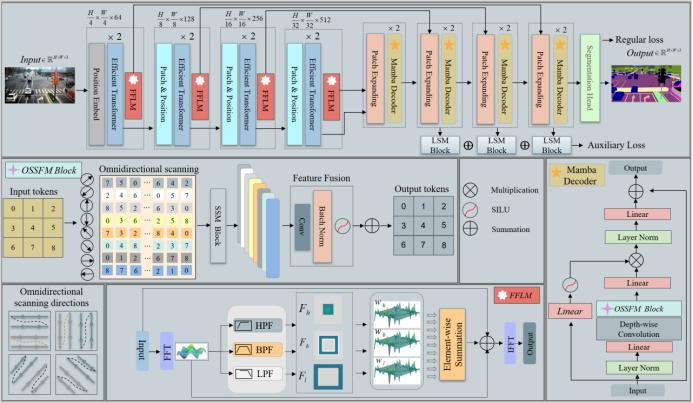

🔥# Superior & Fewer: Harnessing Mamba with Multi-domain Feature Mining for Traffic Scene Parsing🔥 

[](https://www.gnu.org/licenses/gpl-3.0)


📋This is the official implementation of "Superior & Fewer: Harnessing Mamba with Multi-domain Feature Mining for Traffic Scene Parsing"
🌟

## Overview

This paper introduces OSSFM-Mamba, a novel framework that integrates omnidirectional state-space modeling with frequency-domain feature mining for scene parsing, a novel approach that!:

- Efficiently leverages Vision Foundation Models (VFMs) for roadside traffic scene parsing
- Achieves SOTA performance with only 2.5% trainable parameters
- Shows strong generalization capability in zero-shot and few-shot scenarios
- Performs robustly in challenging conditions (night, rain, etc.)



## 📊 Performance
- 🚀**Parameter Efficiency**: Our method achieves these results with only 20.52M parameters and 15.29G FLOPs, representing an 83% reduction in parameter count compared to the 120M-parameter UperNet(Swin-B).
- 🚀**Performance**:
  - Achieving mIoU improvements of 0.56% over UperNet(Swin-B) on CamVid, 2.6% over SegNeXt(MSCAN-B) on RS2K, and notably, a 14.91% gain over UNetMamba(ResT-Base) on the challenging TSP6K dataset.


## 🚀Installation
```bash
# Clone the repository
git clone https://github.com/billfjj/TSPM-Mamba.git
cd ATM-Traffic
conda install pytorch==2.0.1 torchvision==0.15.2 torchaudio==2.0.2 pytorch-cuda=11.7 -c pytorch -c nvidia -y
pip install -e .